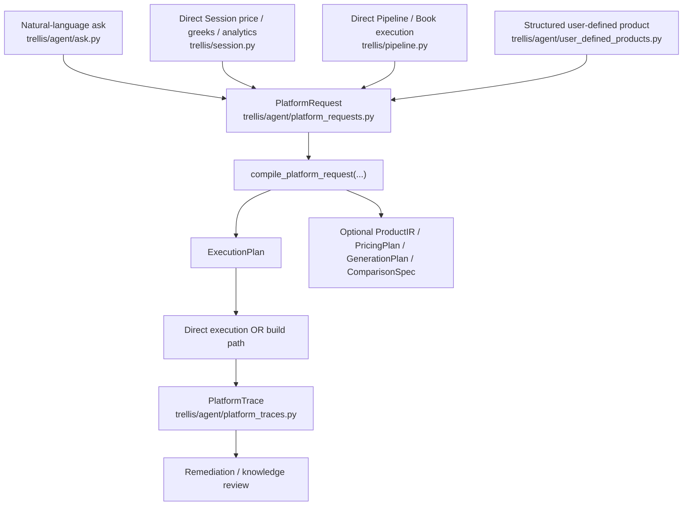
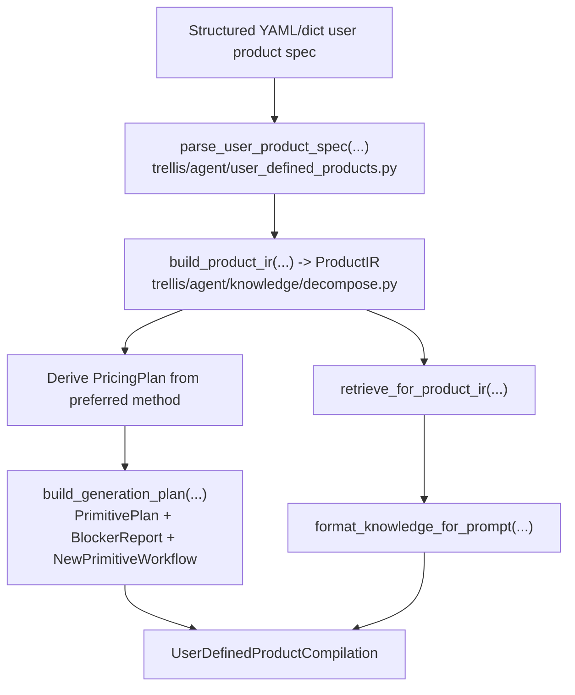
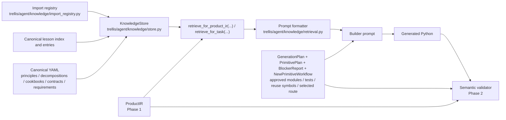
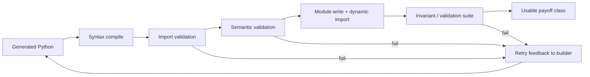

# Agent Workflow Diagrams

This note captures the current post-Phase-3 agent workflow in Trellis.

It is intended as a practical map from:

- user prompt
- to decomposition and knowledge retrieval
- to code generation
- to import and semantic validation
- to module write/import
- to runtime validation and execution
- plus the structured user-defined product compile path added later
- plus the unified platform request/compiler loop added after that

## How To Read This Note

Trellis is not a single monolithic agent. It is a staged pipeline with
different kinds of responsibility:

- decomposition and planning
- knowledge retrieval and prompt guidance
- code generation
- static validation
- runtime validation

The key design choice is that generated code is never trusted just because an
LLM produced it. Each stage either adds structured context or removes invalid
outputs.

## Unified Platform Front Door

## Current Build Flow

```mermaid
flowchart TD
    A["User prompt / task description"] --> B["Optional wrapper: build_with_knowledge()<br/>trellis/agent/knowledge/autonomous.py"]
    A --> C["Direct builder: build_payoff()<br/>trellis/agent/executor.py"]
    A --> T1["Task runner / benchmark metadata<br/>trellis/agent/task_runtime.py"]

    B --> D["Compatibility decomposition + gap check<br/>decompose(...) + gap_check(...)<br/>trellis/agent/knowledge"]
    D --> E["Phase 1 semantic parse<br/>decompose_to_ir(...) -> ProductIR<br/>trellis/agent/knowledge/decompose.py"]
    E --> F["IR-native retrieval<br/>retrieve_for_product_ir(...)<br/>trellis/agent/knowledge/store.py"]
    F --> G["Prompt-ready knowledge text<br/>format_knowledge_for_prompt(...)<br/>trellis/agent/knowledge/retrieval.py"]
    G --> C
    T1 --> T2["Normalize construct / preferred_method / comparison intent"]
    T2 --> T3["Build concrete comparison targets<br/>cross_validate.internal + analytical reference"]
    T3 --> T4["Runtime comparison pricing + tolerance checks"]
    T4 --> B

    C --> H["Phase 1 semantic parse<br/>decompose_to_ir(...) -> ProductIR<br/>trellis/agent/knowledge/decompose.py"]
    C --> I["Quant method selection<br/>select_pricing_method(...)<br/>trellis/agent/quant.py"]
    I --> J["Market-data capability check<br/>trellis/core/capabilities.py"]
    J --> K["Planner<br/>plan_build(...)<br/>trellis/agent/planner.py"]
    K --> L["Cache check / reuse existing _agent module"]
    L -->|cache miss| M["Design spec + generate skeleton"]
    M --> N["Reference gathering + GenerationPlan + PrimitivePlan + BlockerReport<br/>trellis/agent/codegen_guardrails.py"]
    N --> O["Prompt assembly<br/>cookbook + lessons + contracts + requirements<br/>trellis/agent/prompts.py"]
    O --> P["LLM code generation<br/>_generate_module(...)"]

    P --> P1["Empty / invalid LLM response guards<br/>trellis/agent/config.py"]
    P1 --> Q["Import validation<br/>validate_generated_imports(...)"]
    Q -->|fail| O
    Q -->|pass| R["Phase 2 semantic validation<br/>validate_semantics(..., ProductIR, GenerationPlan)<br/>trellis/agent/semantic_validation.py"]
    R -->|fail| O
    R -->|pass| S["Write module + dynamic import"]
    S --> T["Post-build validation<br/>invariants / critic / validation path"]
    T -->|fail| O
    T -->|pass| U["Return payoff class"]
```

## Structured User-Defined Product Flow

## Knowledge and Guidance Flow

## Validation Gates

## Terminology

This document uses "product semantics" and "semantic validation" as defined
in [docs/glossary.md](../glossary.md).  All other uses of "semantic" in this
document refer to one of those two concepts.

## Component Roles

- `cookbook`: positive construction pattern from canonical policy.
- `lessons`: ranked guidance from past failures and fixes.
- `ProductIR`: typed product meaning from Phase 1.
- `GenerationPlan`: repo-backed import/test/reuse constraints from Tranche 2B.
- `PrimitivePlan`: deterministic route and primitive selection from Phase 3,
  now chosen from a scored candidate set.
- `ComparisonSpec`: request-level multi-method comparison intent for benchmark
  tasks such as tree vs PDE vs MC vs transforms.
- `preferred_method`: a request/task-level routing override used to force one
  admissible method family for comparison or benchmark builds.
- `comparison target`: a concrete build target such as `crr_tree`, `mc_exact`,
  `fft`, or `black_scholes` that may share a method family with other targets
  but still needs its own build and runtime comparison result.
- `BlockerReport`: structured missing-primitive taxonomy from Phase 9.
- `NewPrimitiveWorkflow`: concrete implementation workflow for missing
  foundational machinery from Phase 10.
- `semantic_validation`: static Trellis-aware typechecker from Phase 2.
- `cookbook candidate`: a deterministic non-canonical artifact recorded when a
  build succeeds but reflection is too weak to enrich the canonical cookbook
  safely.
- `artifact refs`: build/task results can now carry trace and candidate
  references so the UI can render the raw documents behind a run, not only the
  summarized outcome.

## What Each Diagram Is Showing

### Current Build Flow

This is the operational path through the codebase.

It shows:

- where the quant agent selects a method family
- where planning and skeleton generation happen deterministically
- where IR-native cookbook and lesson context enter the builder prompt
- where primitive-route selection happens before code generation
- where import validation and semantic validation gate the output
- where retries happen before a module is accepted

This is the best diagram for understanding "what happens after a prompt".

### Knowledge and Guidance Flow

This is the policy-and-memory view.

It shows:

- where canonical policy lives
- where live lessons and import registry state enter retrieval
- how prompt guidance differs from semantic validation
- how `ProductIR`, `GenerationPlan`, and `PrimitivePlan` constrain code before and after generation

This is the best diagram for understanding why Trellis uses both retrieval and
validation instead of relying on prompt text alone.

### Structured User-Defined Product Flow

This is the user-facing structured product-semantics view.

It shows:

- how a typed user product spec is parsed without relying on fuzzy natural-language inference
- how that spec is compiled into `ProductIR`
- how the same route, blocker, and workflow stack is reused
- how supported and unsupported user-defined products are both handled deterministically

### Validation Gates

This is the quality-control view.

It shows the order in which candidate code is filtered:

1. syntax
2. import validity
3. semantic validity
4. importability
5. runtime/invariant checks

This matters because different classes of failure should fail at different
layers. A bad import should fail before file write. A semantically wrong
exercise contract should fail before runtime. A numerically unstable but
well-formed implementation should fail during validation.

## Design Philosophy

### 1. Product meaning should be separate from numerical method choice

An `American put` is not the same thing as `LSM`.

It is a product with:

- a payoff family
- an exercise style
- a state dependence pattern
- a model family
- a set of admissible numerical methods

That is why Phase 1 introduced `ProductIR`. The intent is to represent product
semantics first, then select or reject numerical methods against that
representation.

### 2. The agent should assemble from verified primitives, not invent APIs

The agent works best when it wires together real Trellis components.

It fails when it improvises a fake contract, such as:

- inventing unsupported engine modes
- importing the right symbol from the wrong module
- using a pricing engine in a way the library does not actually support

That is why the build flow now includes:

- import registry checks
- approved module sets
- deterministic primitive selection
- semantic validation against known engine contracts

### 3. Canonical policy and live repo knowledge must stay separate

Canonical YAML defines what the system believes is structurally correct:

- cookbook patterns
- decomposition policy
- method requirements
- data contracts

Live repo state defines what exists today:

- current exports
- current package tree
- recent lessons
- traces and failures

The agent needs both, but they play different roles:

- policy tells the agent what *kind* of solution is appropriate
- live knowledge tells the agent what *actually exists* to build with

### 4. Static validation should catch structural mistakes before runtime

Runtime validation is too late for many agent errors.

If the code:

- uses `MonteCarloEngine(method="lsm")`
- imports `LaguerreBasis` from the wrong place
- writes a scalar-only characteristic function for FFT/COS

then the problem is semantic, not numerical. Those failures should be caught
before the module is written and imported.

That is the role of Phase 2 semantic validation.

### 5. The right failure mode is honest incompleteness, not hallucinated support

When Trellis lacks the primitive needed for a composite product, the system
should say so explicitly.

The desired behavior is:

- decompose the product honestly
- identify unresolved primitives
- refuse unsupported method/product combinations

not:

- invent an API
- overclaim support
- produce code that only sounds plausible

## Current Architectural Status

The diagrams show the current state, not the final target state.

What is already true:

- deterministic `ProductIR` exists
- IR-native retrieval exists for the build path
- deterministic `PrimitivePlan` selection exists
- deterministic candidate-route ranking now exists ahead of route selection
- structured blocker taxonomy exists for unsupported routes
- missing-primitive workflows exist for unsupported foundational gaps
- semantic validation exists
- import validation exists
- cookbook and lesson retrieval are unified through the knowledge store

What is still transitional:

- quant method selection still begins from canonical/legacy decomposition labels
- gap checking and some older helpers still depend on the legacy decomposition object
- semantic validation now enforces route/primitive contracts, but broader runtime validation is still separate

So the current architecture now uses the typed product representation across
retrieval, planning, and validation in the main build path. The next major
improvement is to learn from the deterministic route-ranking traces and then
regenerate more complex exercise/control products through the new
assembly-first path.

## Important Current Nuance

The system is substantially IR-native in the main build path, but not every
older helper is fully migrated.

Today:

- `ProductIR` drives retrieval in the direct builder and autonomous wrapper.
- `PrimitivePlan` gives the builder an explicit route plus required primitives.
- semantic validation checks generated code against both `ProductIR` and the
  selected primitive route.

That means:

- prompt guidance is now product-semantic and route-aware
- output checking rejects both fake imports and route/primitive mismatches
- blocked routes fail before code generation instead of producing speculative modules

The next architectural step is not another structural rewrite. It is to improve
route selection quality and use the new assembly-first path to regenerate the
problematic exercise/control artifacts. The same typed product representation now drives:

- cookbook selection
- lesson selection
- primitive-route selection
- method compatibility
- semantic validation
